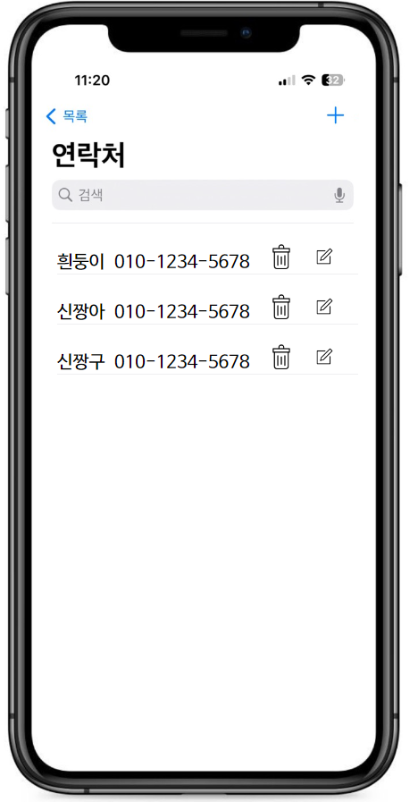
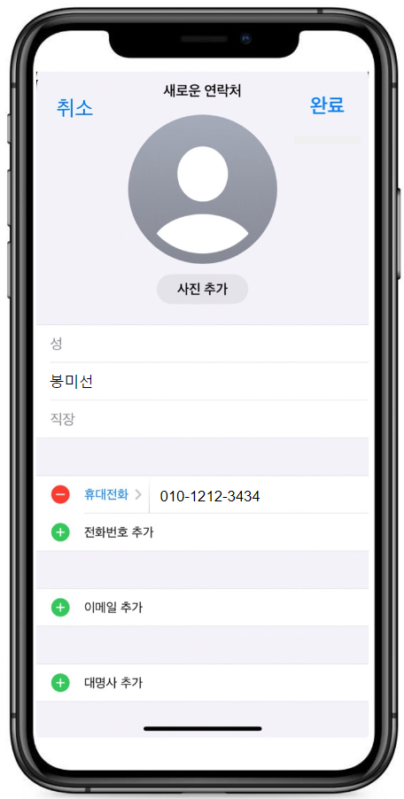
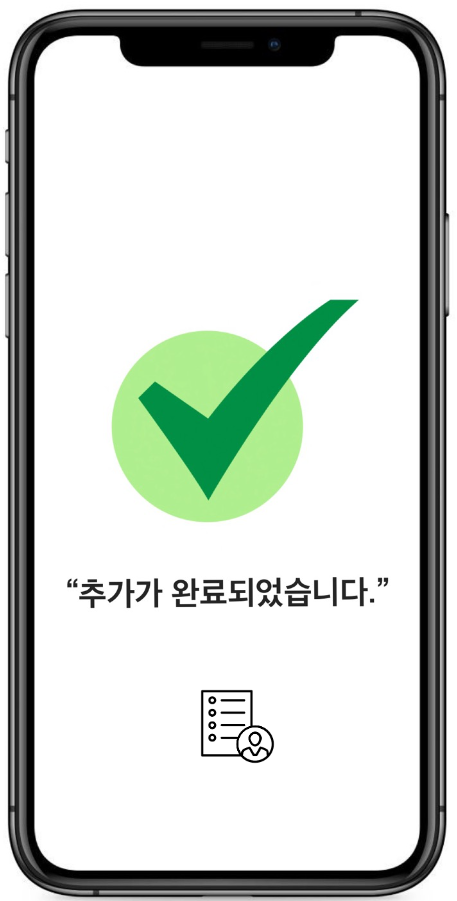
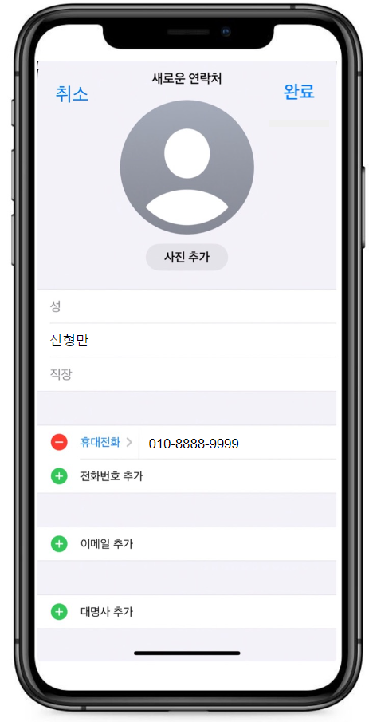
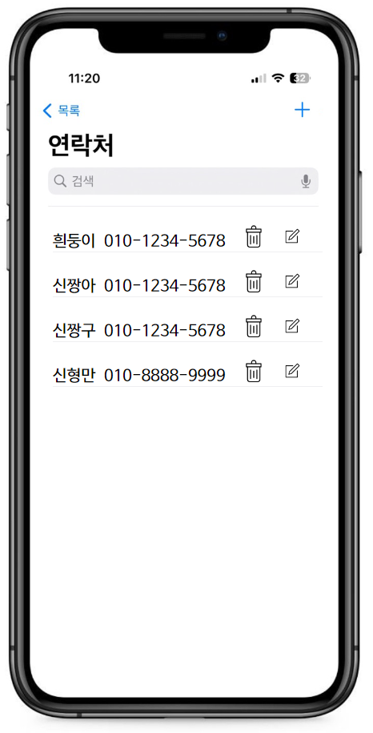
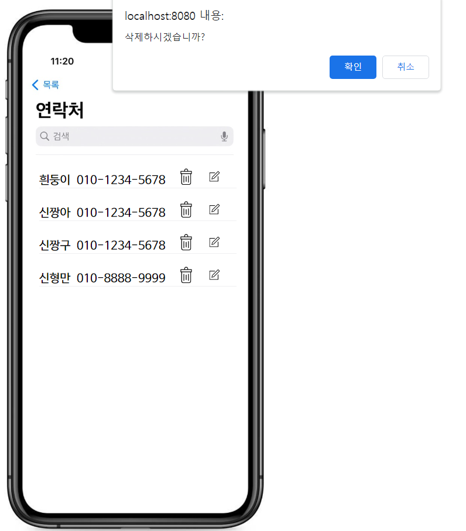
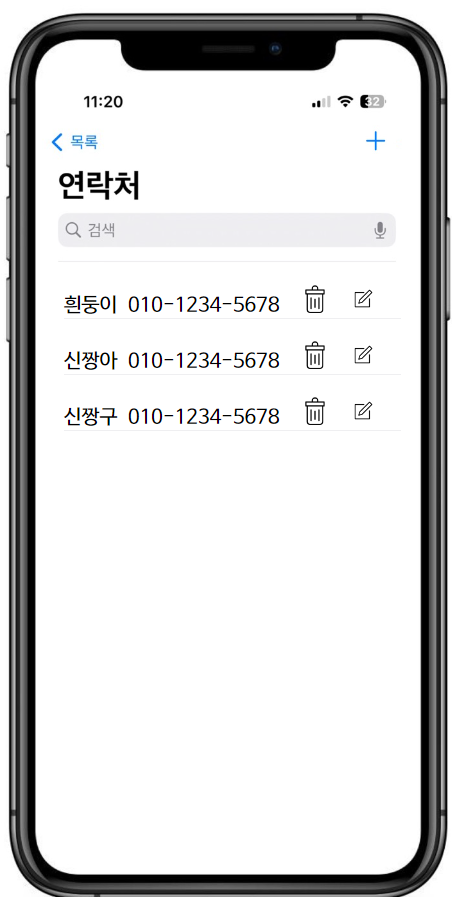

#  Phone Contact
 
##   프로젝트 소개
스마트폰 내의 연락처 어플을 참고하여 만든 연락처를 조회, 추가, 수정, 삭제(CRUD) 할 수 있는 프로그램입니다.

##   개발 기간
2023.12.01 - 2023.12.05

##  설명과 사용 방법

###  연락처 추가
<a href="#A1">

(1)연락처 조회 화면</a> 오른쪽 상단에 을 누른 후 <a href="#A2">(2)이동한 페이지</a>에서 이름과 전화번호를 입력하고 왼쪽 상단의  버튼을 누르면 <a href="#A3">(3)연락처가 추가</a>됩니다. 

(1)

(2)

 

(3)

 
 

###  연락처 수정
<a href="#E1">
(1)연락처 조회 화면</a>에서 수정하고 싶은 연락처의  버튼을 누르면 <a href="#E2">(2)연락처 수정페이지</a>로 이동되고 수정 전 이름과 전화번호가 화면에 나타납니다. 수정하고 싶은 이름과 전화번호를  <a href="#E3">(3)새롭게 입력하고</a> 왼쪽 상단의  버튼을 누르면 <a href="#E4">(4)연락처가 수정</a>됩니다. 

(1)

(2)

(3)

(4)

 
 

###  연락처 삭제
<a href="#D1">
(1)연락처 조회 화면</a>에서 삭제하고 싶은 연락처의   버튼을 누르면 <a href="#D2">(2)알림창이</a> 화면에 나타나고 확인 버튼을 누르면 <a href="#D3">(3)연락처가 삭제</a>됩니다.  

(1)

(2)
 

(3)

