#  Phone Contact
 
##   프로젝트 소개
스마트폰 내의 연락처 어플을 참고하여 만든 연락처를 조회, 추가, 수정, 삭제(CRUD) 할 수 있는 프로그램입니다.

##   개발 기간
2023.12.01 - 2023.12.05

##  설명과 사용 방법

### 연락처 추가

연락처 조회 화면 오른쪽 상단에  버튼을 누르면 연락처 등록 페이지로 이동합니다. 이동한 페이지에서 이름과 전화번호를 입력하고 왼쪽 상단의  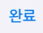 버튼을 누르면 연락처가 추가됩니다. 

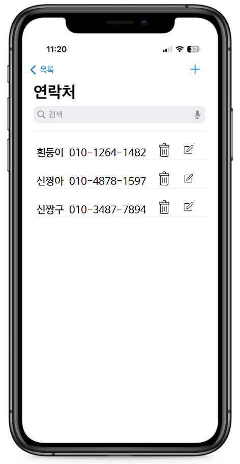
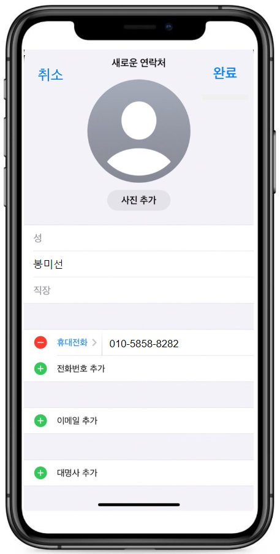
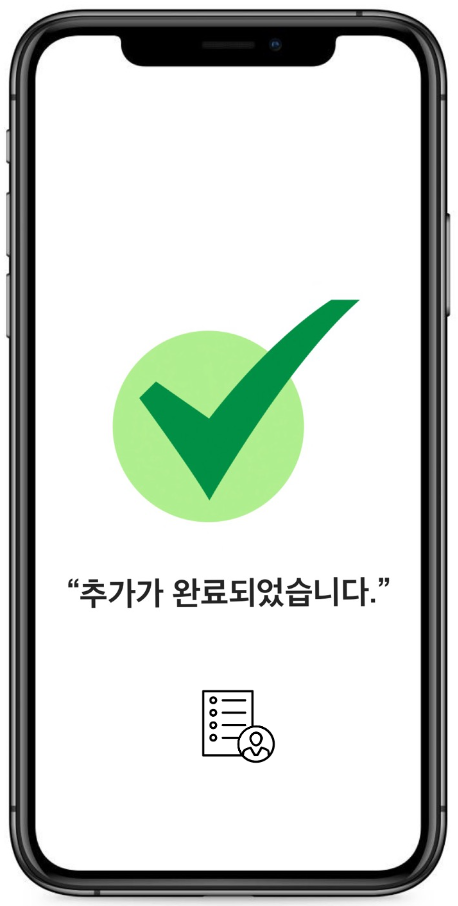
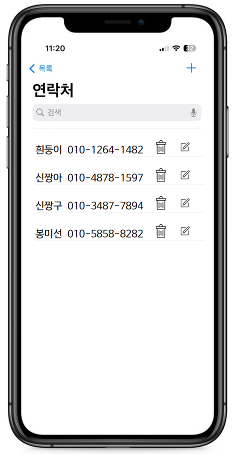

### 연락처 수정

연락처 조회 화면에서 수정하고 싶은 연락처의  버튼을 누르면 연락처 수정페이지로 이동하고 수정 전 이름과 전화번호가 화면에 나타납니다. 수정하고 싶은 이름과 전화번호를 새롭게 입력하고 왼쪽 상단의  버튼을 누르면 연락처가 수정됩니다. 

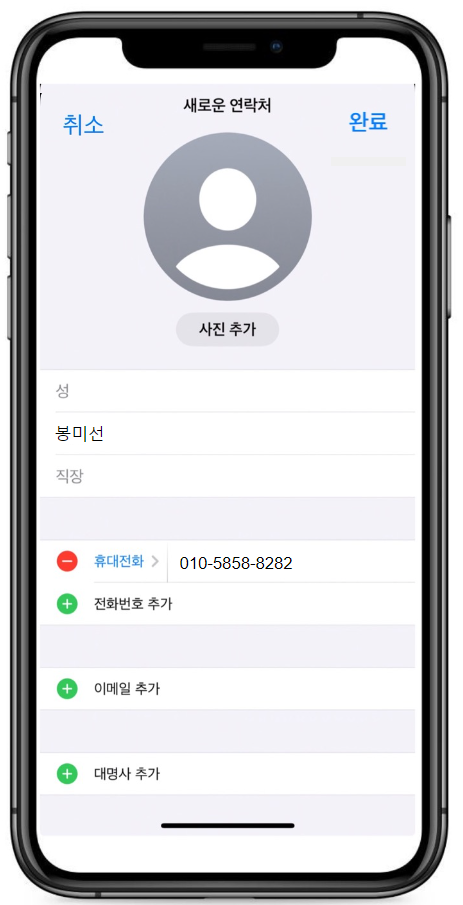
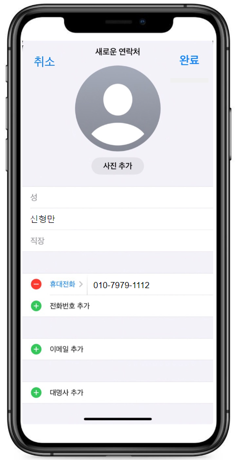
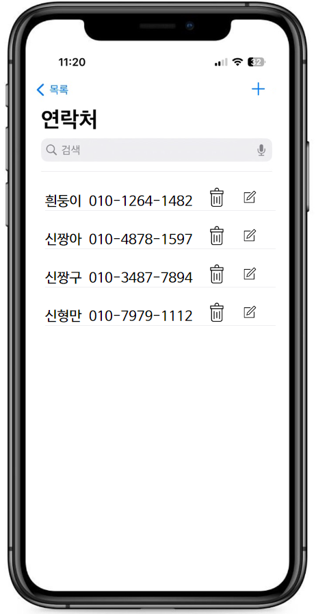

### 연락처 삭제
연락처 조회 화면에서 삭제하고 싶은 연락처의 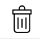  버튼을 누르면 알림창이 화면에 나타나고 확인 버튼을 누르면 연락처가 삭제됩니다.  

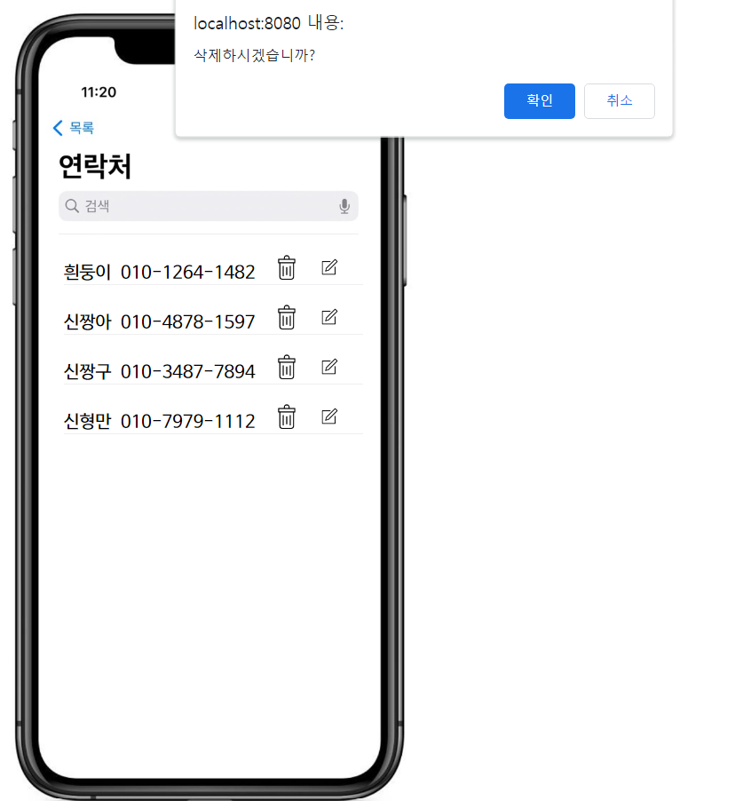
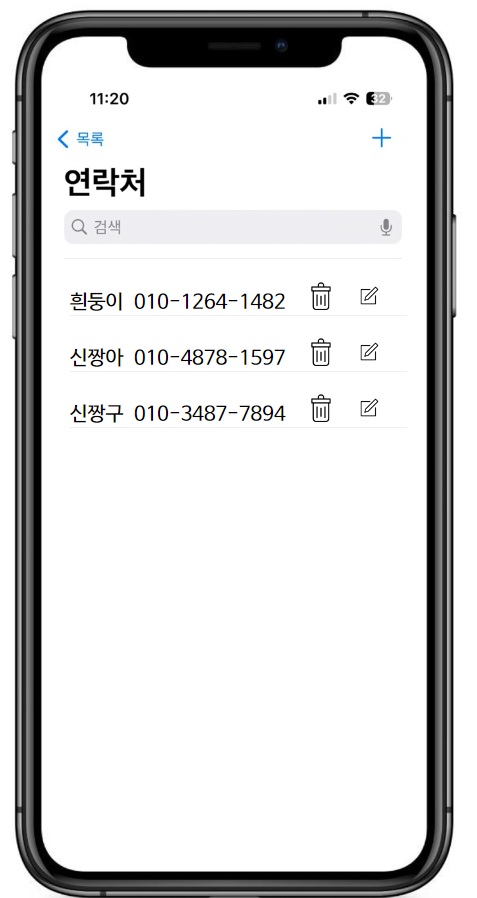